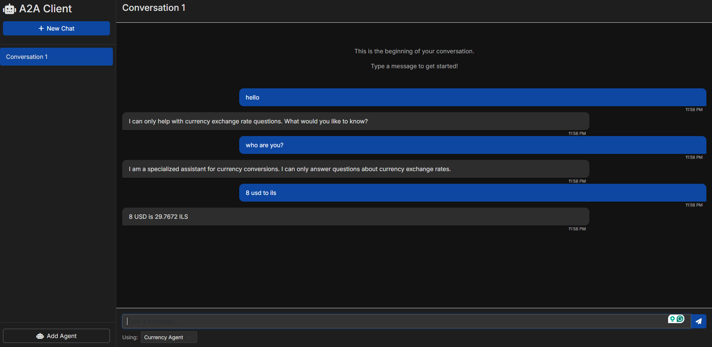

# A2A Client

A Flask-based client application that allows users to communicate with AI agents using the A2A protocol.



## Features

- Create multiple conversations
- Add custom AI agents
- Modern, responsive UI
- Real-time updates via WebSockets

## Setup Instructions

### Prerequisites

- Python 3.8+

### Installation

1. Clone this repository
2. Navigate to the project directory
3. Create a virtual environment:
   ```
   python -m venv venv
   ```
4. Activate the virtual environment:
   - Windows: `venv\Scripts\activate`
   - macOS/Linux: `source venv/bin/activate`
5. Install dependencies:
   ```
   pip install -r requirements.txt
   ```

### Running the Application

1. Make sure your virtual environment is activated
2. Start the application:
   ```
   python app.py
   ```
3. Open your browser and navigate to `http://localhost:5000`

## Using the Application

### Creating a Conversation

Click the "New Chat" button in the sidebar to create a new conversation.

### Sending Messages

1. Select a conversation from the sidebar
2. Choose an AI agent from the dropdown menu
3. Type your message in the input field
4. Press Enter or click the send button

### Adding a Custom Agent

1. Click "Add Agent" in the sidebar
2. Choose "Custom Agent..." from the dropdown
3. Fill in the agent url
   
4. Press Add agent
   

## Tested With

This A2A client has been successfully tested with Google's LangGraph Currency Agent sample:
- [LangGraph Currency Agent with A2A Protocol](https://github.com/google/A2A/blob/main/samples/python/agents/langgraph/README.md)

The above agent provides currency conversion functionality and demonstrates the A2A protocol's capabilities for multi-turn conversations and streaming responses.